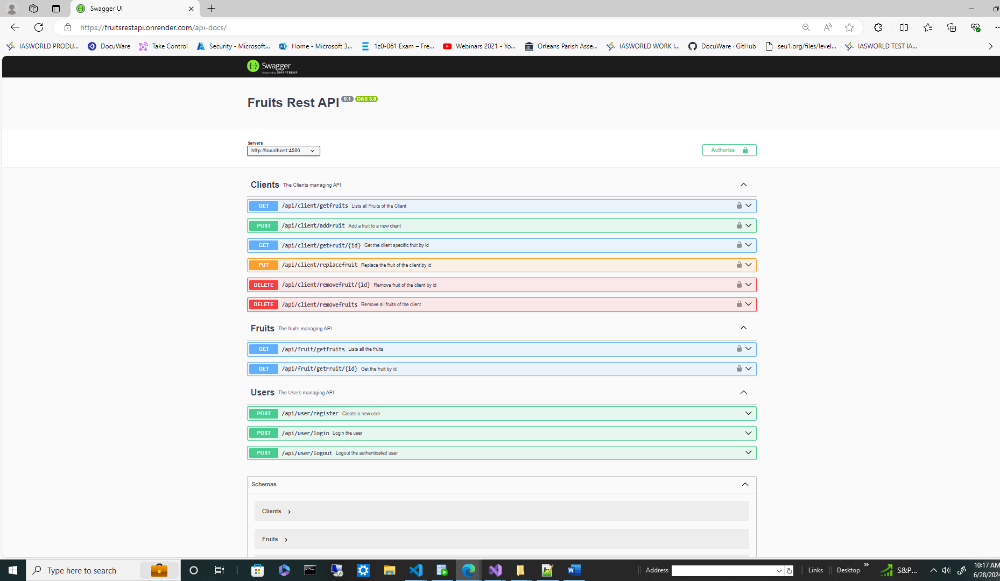
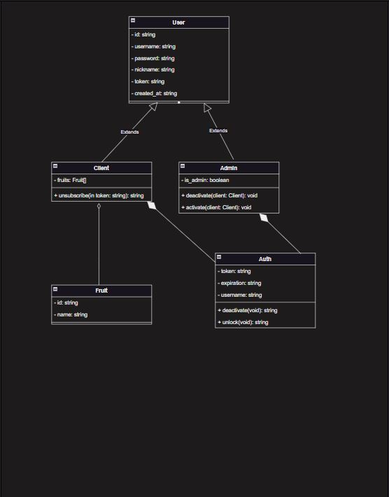
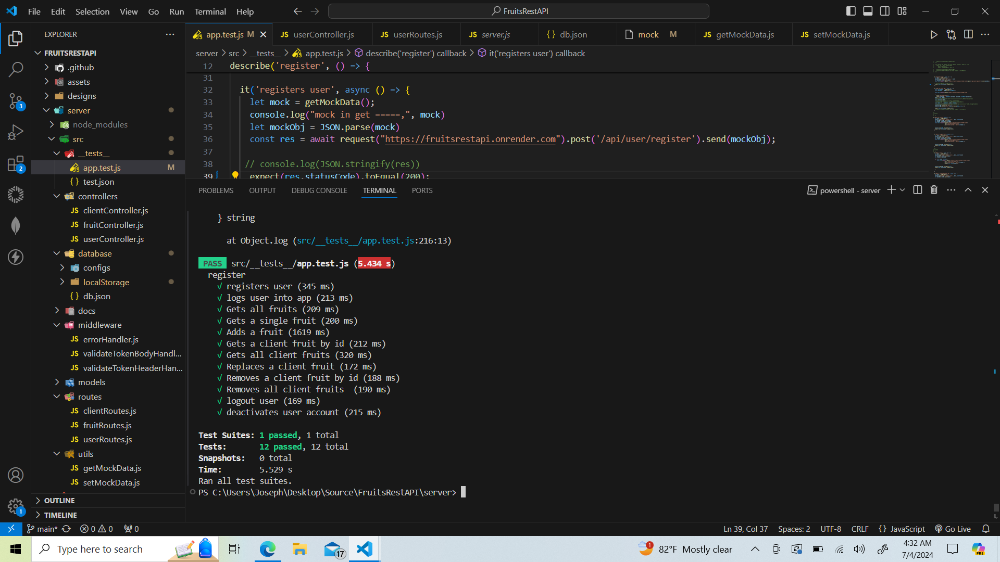

# FRUITS API

# Hi, I'm Joseph Adogeri! 👋

## Description
This is a REST API ,which stores user seesion in an embedded database (lowdb)


## Authors

- [@jadogeri](https://www.github.com/jadogeri)

## Table of Contents

- [Screenshots](#screenshots)
- [Installation](#installation)
- [Tech Stack](#tech-stack)
- [Design](#design)
- [Usage](#usage)
    -[Run Locally](#run-locally)
- [API Documentation](api-documentation)
- [Tests](#tests)
- [About me](#about-me)
- [License](#license)
- [Acknowledgements](#acknowledgements)


## Screenshots

|    

## Installation

[How to install Node.js and npm on Windows, macOS, and Linux](https://kinsta.com/blog/how-to-install-node-js/)

## Tech Stack

**Server:** Node, Express

**Database** lowdb

## Design
 

## Usage

### Run Locally

1 Open command prompt or terminal.

2 Type command git clone https://github.com/jadogeri/FruitsRestAPI.git then press enter.

```bash
  git clone https://github.com/jadogeri/FruitsRestAPI.git
```

3 Enter command cd FruitsRestAPI then press enter.

```bash
  cd FruitsRestAPI
```

4 Navigate to project src folder entering command cd FruitsRestAPI/server.

```bash
  cd /FruitsRestAPI/server
```

5 Type npm install.

```bash
  npm install
```
6 Type npm run dev to run to start server listening to changes or npm start to start server not listening to code changes.

```bash
  npm start
```
or

```bash
  npm run dev
```

## API Documentation


## Tests

1. Change to project view structure
2. navigate to app/src/test unitTest/java/com.example.currencyconverter
3. right click on LogTest.java and select , 

```bash
  run LogTest.java
```


## About Me  
🚀
I'm a Database Programmer learning Typescript and Javascript for my mobile, APIs and data engineering projects


## License

[LICENSE](/LICENSE)

## Acknowledgements

 - [Awesome Readme Templates](https://awesomeopensource.com/project/elangosundar/awesome-README-templates)
 - [Readme.so - The easiest way to create a README](https://readme.so/)
 - [Swagger API Documentation](https://swagger.io/docs/)